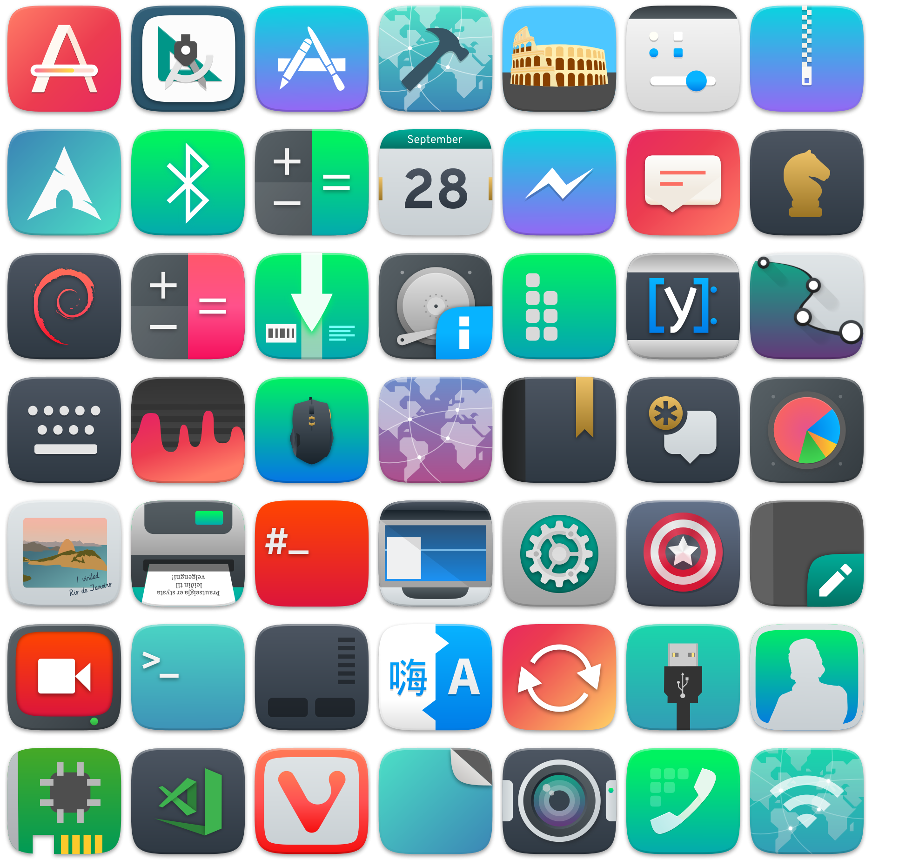
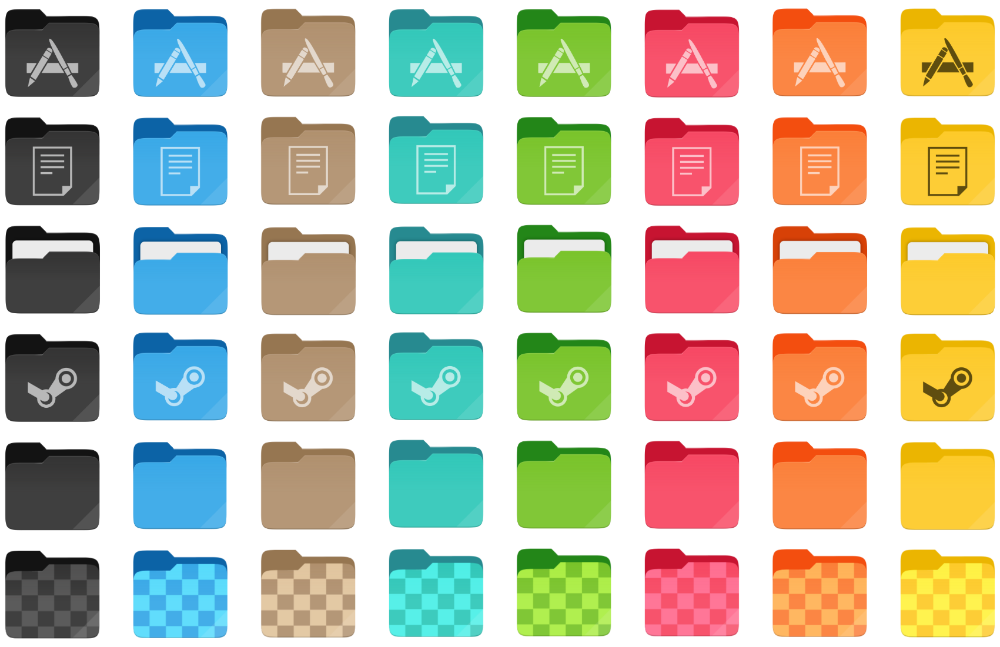
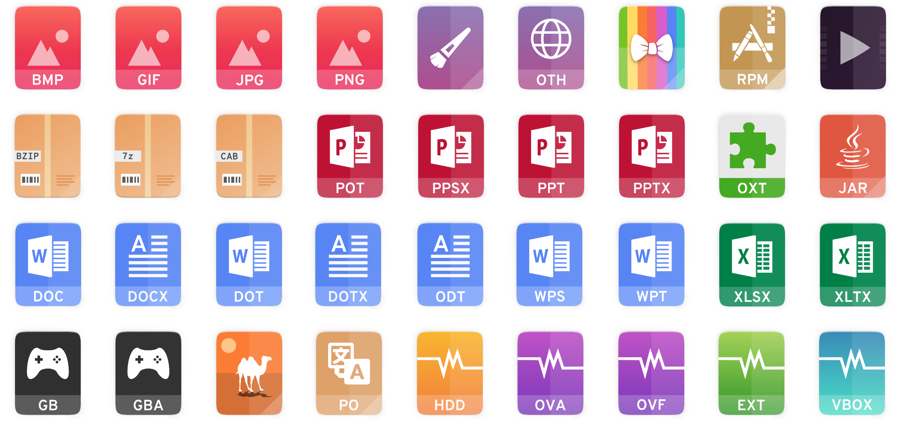
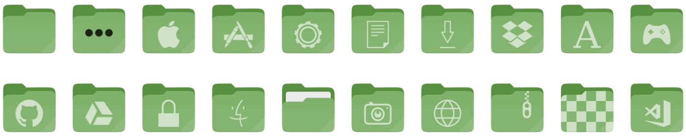
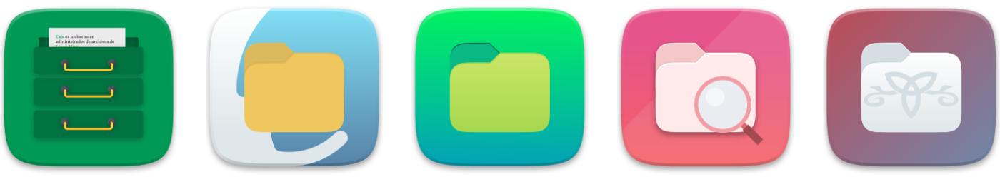

<p align="center">
    
</p>

<h3 align="center">A third-party Suru icons for more than 20 distributions </h3>
<h3 align="center">Successor of <a href="https://github.com/Magog64">@Magog64</a>’s <a href="https://github.com/Magog64/SURU-PLUS">Suru++ Ubuntu</a></h3>
<h3 align="center">A cyberpunkish, elegant, futuristic, macOS-like, papirusified and modern Suru icons based on <a href="https://snwh.org/suru">Suru Icons</a> by Sam Hewitt</h3>

<p align="center">
  
  
  
  
  
  
</p>

<h1>Index</h1>

- [What’s new?](#whats-new)
  - [Version 20.0.0](#version-2000)
    - [Redesign](#redesign)
    - [Folder redesign and 12 folder colours](#folder-redesign-and-12-folder-colours)
    - [Mimetype icons redesign](#mimetype-icons-redesign)
    - [Firefox alternatives](#firefox-alternatives)
    - [New flags icons](#new-flags-icons)
  - [Version 25.0.0](#version-2500)
    - [Folders with colour of Linux Mint](#folders-with-colour-of-linux-mint)
    - [Distinction of file managers](#distinction-of-file-managers)
    - [Steam games](#steam-games)
  - [Version 25.1.0](#version-2510)
    - [Oomox](#oomox)
    - [Alternative icons](#alternative-icons)
- [Installing with CLI](#installing-with-cli)
    - [ROOT directory (recommended)](#root-directory-recommended)
    - [HOME directory for GTK](#home-directory-for-gtk)
    - [HOME directory for KDE](#home-directory-for-kde)
    - [\*BSD systems](#bsd-systems)
    - [Uninstall](#uninstall)
- [Changing the folder colour](#changing-the-folder-colour)
- [Changing the alternative icon](#changing-the-alternative-icon)
  - [Firefox](#firefox)
  - [Alternative icons](#alternative-icons-1)
  - [File manager icon](#file-manager-icon)
- [Known bugs](#known-bugs)
  - [Snap-built apps](#snap-built-apps)
  - [AppImage-built apps](#appimage-built-apps)
  - [Hardcoded application icons with ugly name](#hardcoded-application-icons-with-ugly-name)
  - [Hardcoded tray icons](#hardcoded-tray-icons)
  - [Unrecognised and ugly icons](#unrecognised-and-ugly-icons)
    - [Okular icon and other icons](#okular-icon-and-other-icons)
- [Report](#report)
- [Contribution](#contribution)
- [Contributors](#contributors)
- [Changelog](#changelog)
- [Credits and Licences](#credits-and-licences)

## What’s new?

### Version 20.0.0

#### Redesign

Following Sam Hewitt’s rules of grids, and making less conservative and traditional <a href="https://github.com/Magog64">@Magog64</a>’s <a href="https://github.com/Magog64/SURU-PLUS">Suru++ Ubuntu</a>, more than 15k icons have been redesigned, papirusified and improved with new cyberpunk colours and made been compatible with KDE, XFCE and other many environments! Check the new icons:



#### Folder redesign and 12 folder colours

The new versions has won new colours of folders, based by Alexey Varfolomeev’s Papirus:



#### Mimetype icons redesign

Almost all mimetype icons have been redesigned with new colours and are based on Numix mimetype icons:



#### Firefox alternatives

You can choose one of three alternatives of Firefox:

|  |  |  |
| :---------------------------------: | :---------------------: | :-----------------------------: |
|             Traditional             |        Suru++ 20        |       Mozilla Unofficial        |
|      `firefox-traditional.svg`      |      `firefox.svg`      |      `firefox-mozilla.svg`      |

To change the alternative icon, click to see [Changing the alternative icon](#changing-the-alternative-icon). 

#### New flags icons

New countries flags (in development)!

### Version 25.0.0

#### Folders with colour of Linux Mint

Suru++ won the new folders with colour of Linux Mint:



#### Distinction of file managers

The file managers are no longer same, now are different and modern:

<p align="center">
    
</p>

To change the default icon of each file manager (Caja, Nautilus, Nemo, etc.), see [File manager icon](#file-manager-icon).

#### Steam games

Hundreds Steam games icons are supported officially:

<p align="center">
    
</p>

### Version 25.1.0

#### Oomox

Suru++ is officially compatible with with @actionless's [Oomox](https://github.com/themix-project/oomox). You can change any colour of all 16px icons and of all folders once in a while!

#### Alternative icons

Redesigned by [@darcn181](https://github.com/darcn181). You can choose one of your alternates. To change the alternate, please see [Alternative icons](#alternative-icons).

|        Icon name         |                      Default                      |                        Alt 1                         |                        Alt 2                         |              Alt 3               |              Alt 4               |
| :----------------------: | :-----------------------------------------------: | :--------------------------------------------------: | :--------------------------------------------------: | :------------------------------: | :------------------------------: |
|         settings         |                  |                  |                  |                -                 |                -                 |
|       sublime-text       |              |               |                          -                           |                -                 |                -                 |
|    system-lock-screen    |        |        |        |                -                 |                -                 |
|      system-log-out      |            |            |            |                -                 |                -                 |
|      system-reboot       |             |             |             |                -                 |                -                 |
|     system-shutdown      |           |           |           |                -                 |                -                 |
|      system-suspend      |            |            |            |                -                 |                -                 |
| system-suspend-hibernate |  |  |  |                -                 |                -                 |
|           user           |                      |                      |                      |  |  |

## Installing with CLI

Use the scripts to install the latest version directly from this repo (independently of your distro):

**NOTE:** Use the same command to update the icon theme.

#### ROOT directory (recommended)

```
wget -qO- https://raw.githubusercontent.com/gusbemacbe/suru-plus/master/install.sh | sh
```

#### HOME directory for GTK

```
wget -qO- https://raw.githubusercontent.com/gusbemacbe/suru-plus/master/install.sh | env DESTDIR="$HOME/.icons" sh
```

#### HOME directory for KDE

```
wget -qO- https://raw.githubusercontent.com/gusbemacbe/suru-plus/master/install.sh | env DESTDIR="$HOME/.local/share/icons" sh
```

#### \*BSD systems

```
wget -qO- https://raw.githubusercontent.com/gusbemacbe/suru-plus/master/install.sh | env DESTDIR="/usr/local/share/icons" sh
```

#### Uninstall

```
wget -qO- https://raw.githubusercontent.com/gusbemacbe/suru-plus/master/install.sh | env uninstall=true sh
```

## Changing the folder colour

Please visit directly the tutorial: [Suru++ Folders](https://github.com/gusbemacbe/suru-plus-folders). The tutorial is translated in 7 languages.

## Changing the alternative icon

### Firefox

1. Go to `/usr/share/applications/`;
2. Go to the desktop file `Firefox`;
3. Open the file with your favourite text editor;
4. Find `Icon=...` and modify it with one of three alternatives: `Icon=firefox` or `Icon=firefox-mozilla` or `Icon=firefox-traditional`. Save it.

### Alternative icons

1. Run `cd "go_to_/Suru++/64/"`;
2. Download the script [`alt-icon.sh`](./scripts/alt-icon.sh), make it executable and trusted and copy the path of this script to the terminal;
3. For example:

```bash
cd ~/.local/share/icons/Suru++/64
$ ~/.local/share/icons/Suru++/64
~/alt-icon.sh
=> Old symlink
user.svg
=> New symlink
user-alt1.svg
```

If you do not like one alternate and want to try another, run like:

```bash
=> Old symlink
user-alt1.svg
=> New symlink
user-alt2.svg
```

### File manager icon

1. Go to the folder  `/usr/share/applications`, for example, if you want to change the default icon of Nautilus, your favourite file manager, find `nautilus.desktop` 
2. Run as `sudo` and change `Icon=...` to any of these:

 * `Icon=file-manager`
 * `Icon=caja`
 * `Icon=nautilus`
 * `Icon=nemo`
 * `Icon=sapcefm-find`
 * `Icon=thunar`


Remember that if you make an upgrade of your system, these desktop files will revert to the original icon name. Move them to `~./local/share/applications`. Note that after the upgrade of your system, it will add the desktop files in the `/usr/share/applications`, so you need to remove them. 

## Known bugs

### Snap-built apps

Unfortunately the snap-built apps are not supported almost by any icons themes, because the icons are hardcoded and the desktop files are not hosted in the folder `~/.local/share/applications` or `/usr/share/applications`.

To solve it, please follow the instructions:

1. Do:

```bash
# Copy all desktop files of all snap-built apps to "~/.local/share/applications"
sudo cp /var/lib/snapd/desktop/applications/*.desktop ~/.local/share/applications
# To de-sudo the files
sudo chmod -R 777 ~/.local/share/applications
# To remove the duplicates
sudo rm /var/lib/snapd/desktop/applications/*.desktop
```

2. Go to the directory  `~/.local/share/applications`;
3. Open each desktop file of snap app with your favourite text editor and modify the encoded path of `Icon` to the simple path with no extension. For example, if you use Insomnia:

```bash
Icon=snap/icons/icon.png
Icon=insomnia
```

### AppImage-built apps

With AppImageLauncher installed, you click an AppImage, it is automatically integrated to `~/Applications`, and desktop files are automatically created into `~/local/share/applications`. But if you modify one of the AppImage-built app desktop file to correct the icon path, AppImageLauncher reverts automatically the desktop file to the original and keeps again the icon path hardcoded. It also removes the option `StartupWMClass`. We recommend you to ban `AppImageLauncher`. 

1. Remove `appimagelauncher` via terminal;
2. Make all AppImages executable and trusted:

```bash
chmod a+x *.AppImage
```

3. Reboot;
4. Create the desktop files manually in the directory `~/.local/share/applications`. Do not forget of adding the option `StartupWNClass` or the icon will be unrecognised or ugly. 

### Hardcoded application icons with ugly name

We have already icons, but it is wrong or ugly name, or because the icon is hardcoded. For example, the application Github Desktop used `Icon=desktop.png` and other apps, like Insomnia, use `Icon=icon.png`, or worse, `Icon=stupid/path/icon.png`. 

To deal with hardcoded application icons we recommend to install [hardcode-fixer](https://github.com/Foggalong/hardcode-fixer). Suru++ supports most of the applications in the list. If [hardcode-fixer](https://github.com/Foggalong/hardcode-fixer) doesn't support your favourite app yet, please open an [issue here](https://github.com/Foggalong/hardcode-fixer/issues) or edit your .desktop file manually.

### Hardcoded tray icons

To fix hardcoded tray icons, install and use [Hardcode-Tray script](https://github.com/bil-elmoussaoui/Hardcode-Tray). A list of supported applications is available here.

To get Suru++ to work right with [Hardcode-Tray script](https://github.com/bil-elmoussaoui/Hardcode-Tray), use the `hardcode-tray option --conversion-tool RSVGConvert`:

```bash
sudo -E hardcode-tray --conversion-tool RSVGConvert --size 22 --theme Suru++
```

### Unrecognised and ugly icons

#### Okular icon and other icons

Not just Suru++, it also affects Numix icons theme. It is a missed `StartupWMClass` option in the desktop files in KDE and an icon cache bug in GNOME and KDE. 

1. Install and use [StartupWMClassFixer](https://github.com/bilelmoussaoui/StartupWMClassFixer);
2. Install and use [Stacer](https://github.com/oguzhaninan/Stacer) to clean caches;
3. Log out and log in.

## Report

* Do you find the missed icons?
* Do you find the misused and ugly icons?
* Did you find the errors?

Report, but please provide well-detailed information. Or I will have difficulty to understand what you are saying or to know which app you are referring.

## Contribution

* Would you like to improve our repository?
* Do you want to add and request the icons? Make a pull request and we will analyse and approve or not.

## Contributors

The contributors is on the file [AUTHORS](AUTHORS).

## Changelog

The changelog is available on the release page in theme's repository.

## Credits and Licences

* CC BY-SA/GPL3 © 2018-2019 [Suru Icons](https://github.com/snwh/suru-icon-theme) by [Sam Hewitt](https://github.com/snwh).
* GPL3 © 2018-2019 [Suru++ Ubuntu](https://github.com/Magog64/suru-plus) by [Andrea Bonanni](https://github.com/Magog64) and Gustavo Costa.
* GPL3 © 2018-2019 Suru++ 25 by Gustavo Costa.
* GPL3 © [Papirus](https://github.com/PapirusDevelopmentTeam/) by [Alexey Varfolomeev](https://github.com/varlesh).
* GPL3 © [Numix](https://github.com/numixproject/numix-icon-theme) by Numix Team.
* GPL3/MIT © 2015-2019 [La Capitaine](https://github.com/keeferrourke/la-capitaine-icon-theme) by [Keefer Rourke](https://github.com/keeferrourke).
* MIT © Icons 8 by Gravit Designer<sup>1</sup>
* MIT © Twemoji by Twitter Team.

<hr>
<sup>1</sup> Gravit Designer has a special agreement with Icons 8 and allows the Pro user of Gravit Designer to use any icon without attribution and to sublicence under an open source licence. See the <a href="https://discuss.gravit.io/t/licence-of-icons/2767">topic here</a>.
