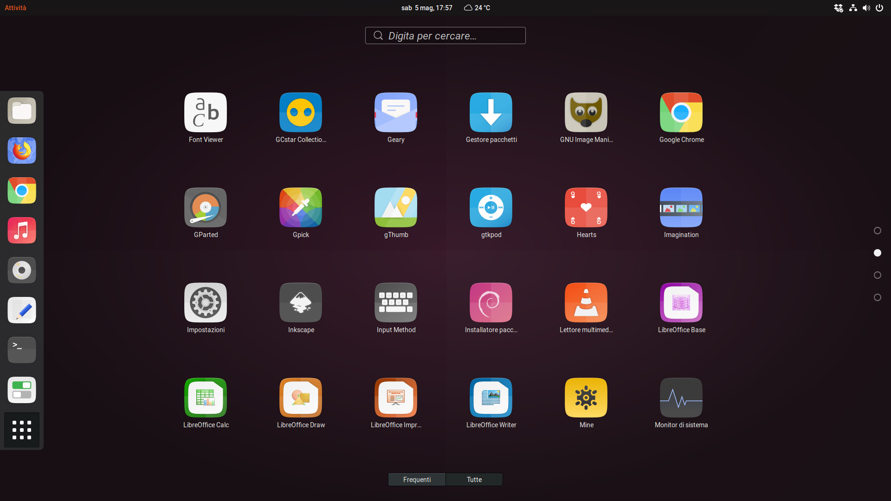

<p align="center"> 

</p>

<h3 align="center">A third-party Suru icons for Ubuntu 18.04</h3>

<h3 align="center">An elegant, modern and sweet Suru icons based on <a href="https://snwh.org/suru">Suru Icons</a> by Sam Hewitt</h3>



## Installation

The good news is that, you are no longer required to depend on Sam Hewitt's and other Suru++ packs.

### PPA (Ubuntu and Debian-derived)

The another good news is that, you can say goodbye to non-CLI and CLI instruction, install like a Millennium Falcon. Gustavo Costa's (@gusbemacbe) official PPA is:

```shell
sudo add-apt-repository ppa:gusbemacbe/ppa
sudo apt-get update
sudo apt install suru-plus-pack
```

The full pack comes with all gifts - Suru++ cursor, GTK and icons themes and wallpapers. Be happy to receive daily updates.

### For Lubuntu users

As you want 24px and 26px icons to be colourful in the panel, and want the dark theme, please visit:

* [Suru++ Lubuntu](https://github.com/gusbemacbe/suru-plus-lubuntu/)
* [Suru++ Dark Lubuntu](https://github.com/gusbemacbe/suru-plus-dark-lubuntu/)

### Installation without CLI

* [For users of before Ubuntu 18.04 and any old and new Debian-derived distributions.](instructions_without_cli1.md)
* [For users of Ubuntu 18.04](instructions_without_cli2.md).

### Installation with CLI

* [For users of old Ubuntu versions, Ubuntu 16.04 and any Debian-derived distributions.](instructions_with_cli1.md)
* [For users of Ubuntu 16.04.4 and above, 18.04, Kali Linux and any new Debian-derived distributions.](instructions_with_cli2.md)

  ### **AUR (Arch Linux and Arch-derived), dnf (Fedora and Fedora-derived), yum (CentOS and CentOS-derived) and zypper (openSUSE)**

Soon...

## Bugs and reports

### Many apps are not well displayed

It is not the pack's problem. It is the desktop files problem because:
* Snap apps are very buggy and can't be open and as Gnome-Characters, Gnome-Logs, Gravit Designer and Vectr, use the different path and use the ICO/PNG extension added instead;
* The desktop files of certain native apps as IBus and Mozc for Chinese, Japanese and Korean languages use the different relative path of an icon, use the PNG format added a SVG extension, turn the icons unrecognisable by the icons packs,

We have already reported these issues:
* CrossFTP: 
* GitHub Desktop: [view the issue](https://github.com/shiftkey/desktop/issues/42#issuecomment-387865477)
* Gravit Designer: [view the issue](https://discuss.gravit.io/t/linux-package-feature-requests/294/20)
* IBus: [view the issue](https://github.com/phuang/ibus-pinyin/issues/13)
* Mozc Setup: [view the issue](https://github.com/google/mozc/issues/440)

We provide desktop files (AppImage, native Debian packages, snap app and source codes) for you for being able of opening the apps and displaying well the icons. They are in the folder `desktop`. Copy them to `your_name/local/applications/`, so they won't be affected or modified when you make next updates of Ubuntu and/or PPAs.

We recommend you to back your files up when you intend to make a clean install or reinstall your distribution.

* Do you find the missed icons?
* Do you find the misused icons?
* Did you find the errors?

Report, but please provide well-detailed informations:

* Distribution and version
* Steps to reproduce
* Expected behavior
* Actual behavior
* Description
* Missed icons
  * Apps names
  * Missed icon names from the desktop files of `/usr/share/applications` and `yourname/.local/share/applications/`):
  * Screenshots
* Additional information

## Contribution

* Would you like to improve our repository?
* Do you want to add and request the icons? Make a pull request and we will analyse and approve or not

## Contributors

The contributors is on the file AUTHORS

## Changelog

The changelog is available on the release page in theme's repository.

## License

GPL3 © Suru++ by Andrea Bonanni and Gustavo Costa