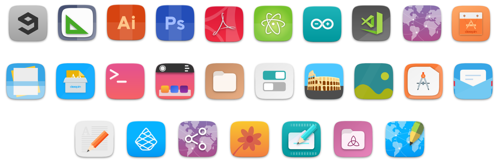

<p align="center"> 
    
</p>

<h3 align="center">A third-party Suru icons for more than 20 distributions </h3>
<h3 align="center">Successor of <a href="https://github.com/Magog64">@Magog64</a>’s <a href="https://github.com/Magog64/SURU-PLUS">Suru++ Minimal</a></h3>
<h3 align="center">An elegant, modern and sweet Suru icons based on <a href="https://snwh.org/suru">Suru Icons</a> by Sam Hewitt</h3>

<h1>Index</h1>

- [What’s new in the new version 20?](#whats-new-in-the-new-version-20)
- [Installing with CLI](#installing-with-cli)
    - [Git](#git)
    - [Subversion](#subversion)
- [Changing the folder colour](#changing-the-folder-colour)
- [Known bugs](#known-bugs)
    - [This icon theme do not apply correctly the apps icons](#this-icon-theme-do-not-apply-correctly-the-apps-icons)
    - [Some icons are not applied correctly and look bad in KDE](#some-icons-are-not-applied-correctly-and-look-bad-in-kde)
- [Report](#report)
- [Contribution](#contribution)
- [Contributors](#contributors)
- [Changelog](#changelog)
- [Credits and Licence](#credits-and-licence)

## What’s new in the new version 20?

* Following Sam Hewitt’s rules of colours and grids, more than 15k icons have been redesigned and improved with new sexy colours and made been compatible with KDE, XFCE and other many environments! Check the new icons:



* The new versions has won new colours of folders, based by Alexey Varfolomeev’s Papirus:


* Almost all mimetype icons have been redesigned with new colours and are based on NUmix mimetype icons:


* You can choose one of three alternatives of Firefox:

|  |  |  |
| :----------------------------------------------------------------------------------------: | :--------------------------------------------------------------------------: | :--------------------------------------------------------------------------------: |
| Traditional                                                                                | Suru++ 20                                                                    | Mozilla Unofficial                                                                 |
| `firefox-traditional.svg`                                                                  | `firefox.svg`                                                                | `firefox-mozilla.svg`                                                              |

**How to change the alternative of these?**

1. Go to `/usr/share/applications/`;
2. Go to the desktop file `Firefox`;
3. Open the file with your favourite text editor;
4. Find `Icon=...` and modify it with one of three alternatives: `Icon=firefox` or `Icon=firefox-mozilla` or `Icon=firefox-traditional`. Save it.

## Installing with CLI

It is too easy and quick to install. I recommend strongly the SVN. Firstly you must install both packages `git` and `subversion`.

### Git

* Install the package `git`;
* Clone the repository :
```shell
$ sudo git clone https://github.com/gusbemacbe/suru-plus.git /usr/share/icons/Suru++
```
* Set the icon theme:
```shell
$ gsettings set org.gnome.desktop.interface icon-theme "Suru++"
```
* And do you want to keep updating?
```shell
$ cd /usr/share/icons/Suru++
$ sudo git pull
```

### Subversion

Run SVN like a Millennium Falcon with coaxium than Git, less than 10 parsecs:

```shell
sudo svn export --force https://github.com/gusbemacbe/suru-plus/trunk/ /usr/share/icons/Suru++
```

## Changing the folder colour

Please visit directly the tutorial: [Suru++ Folders](https://github.com/gusbemacbe/suru-plus-folders). The tutorial is translated in 7 languages.

## Known bugs

### This icon theme do not apply correctly the apps icons

Some apps, as AppImage-built, Snap-built and dpkg-installed apps do not use relative path or relative icon. They use absolute path. Other apps use misleading icon name, for example, GitHub Desktop uses the `Icon=desktop`.  

### Some icons are not applied correctly and look bad in KDE

Since this new version is officially supported for KDE, please report the misdisplayed icon to m that I will analyse and fix. 

## Report

* Do you find the missed icons?
* Do you find the misused icons?
* Did you find the errors?

Report, but please provide well-detailed informations. Or I will have difficulty to understand what you are saying or to know which app you are referring.

## Contribution

* Would you like to improve our repository?
* Do you want to add and request the icons? Make a pull request and we will analyse and approve or not.

## Contributors

The contributors is on the file [AUTHORS](AUTHORS).

## Changelog

The changelog is available on the release page in theme's repository.

## Credits and Licence

* CC-BYSA/GPL3 © 2018 Suru by Sam Hewitt.
* GPL3 © 2018 Suru++ [Minimal] by Andrea Bonanni and Gustavo Costa. 
* GPL3 © 2018 Suru++ 20 by Gustavo Costa.
* GPL3 © Papirus by Alexey Varfolomeev.
* GPL3 © Numix by Numix Team.
* MIT © Twemoji by Twitter Team.
* CC-BYSA © Some Icons by Flaticon. 
