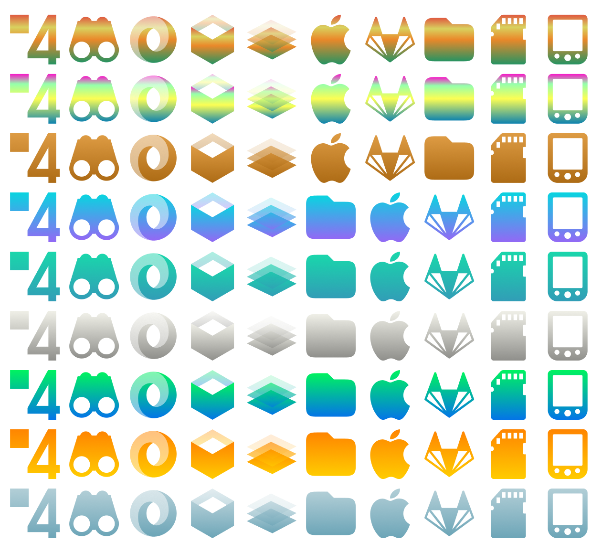

    

<h3 align="center">A third-party Suru icons for more than 20 distributions </h3>
<h3 align="center">Successor of <a href="https://github.com/Bonandry">@Bonandry</a>’s <a href="https://github.com/Bonandry/SURU-PLUS">Suru++ Ubuntu</a></h3>
<h3 align="center">A cyberpunkish, elegant, futuristic, macOS-like, papirusified and modern Suru icons based on <a href="https://snwh.org/suru">Suru Icons</a> by Sam Hewitt</h3>

  
  
  
  
  
  

<h1>Index</h1>

<!-- TOC -->

- [What’s new?](#whats-new)
  - [Version 20.0.0](#version-2000)
    - [Redesign](#redesign)
    - [Folder redesign and 12 folder colours](#folder-redesign-and-12-folder-colours)
    - [Mimetype icons redesign](#mimetype-icons-redesign)
    - [Firefox alternatives](#firefox-alternatives)
    - [New flags icons](#new-flags-icons)
  - [Version 25.0.0](#version-2500)
    - [Folders with colour of Linux Mint](#folders-with-colour-of-linux-mint)
    - [Distinction of file managers](#distinction-of-file-managers)
    - [Steam games](#steam-games)
  - [Version 25.1.0](#version-2510)
    - [Oomox](#oomox)
    - [Alternative icons](#alternative-icons)
  - [Version 25.2.0](#version-2520)
    - [Gradient support for small icons](#gradient-support-for-small-icons)
    - [New three folders colours – Indigo, pink and Manjaro-coloured](#new-three-folders-colours-%E2%80%93-indigo-pink-and-manjaro-coloured)
- [Credits and Licences](#credits-and-licences)

<!-- /TOC -->

## What’s new?

### Version 20.0.0

#### Redesign

Following Sam Hewitt’s rules of grids, and making less conservative and traditional <a href="https://github.com/Bonandry">@Bonandry</a>’s <a href="https://github.com/Bonandry/SURU-PLUS">Suru++ Ubuntu</a>, more than 15k icons have been redesigned, papirusified and improved with new cyberpunk colours and made been compatible with KDE, XFCE and other many environments! Check the new icons:

#### Folder redesign and 12 folder colours

The new versions has won new colours of folders, based by Alexey Varfolomeev’s Papirus:

#### Mimetype icons redesign

Almost all mimetype icons have been redesigned with new colours and are based on Numix mimetype icons:

#### Firefox alternatives

You can choose one of three alternatives of Firefox:

|  |  |  |
| :---------------------------------: | :---------------------: | :-----------------------------: |
|             Traditional             |        Suru++ 20        |       Mozilla Unofficial        |
|      `firefox-traditional.svg`      |      `firefox.svg`      |      `firefox-mozilla.svg`      |

To change the alternative icon, click to see [Changing the alternative icon](#changing-the-alternative-icon).

#### New flags icons

New countries flags (in development)!

### Version 25.0.0

#### Folders with colour of Linux Mint

Suru++ won the new folders with colour of Linux Mint:

#### Distinction of file managers

The file managers are no longer same, now are different and modern:

    

To change the default icon of each file manager (Caja, Nautilus, Nemo, etc.), see [File manager icon](#file-manager-icon).

#### Steam games

Hundreds Steam games icons are supported officially:

    

### Version 25.1.0

#### Oomox

Suru++ is officially compatible with with @actionless's [Oomox](https://github.com/themix-project/oomox). You can change any colour of all 16px icons and of all folders once in a while!

#### Alternative icons

Redesigned by [@darcn181](https://github.com/darcn181). You can choose one of your alternates. To change the alternate, please see [Alternative icons](#alternative-icons).

|        Icon name         |                      Default                      |                        Alt 1                         |                        Alt 2                         |              Alt 3               |              Alt 4               |
| :----------------------: | :-----------------------------------------------: | :--------------------------------------------------: | :--------------------------------------------------: | :------------------------------: | :------------------------------: |
|         settings         |                  |                  |                  |                -                 |                -                 |
|       sublime-text       |              |               |                          -                           |                -                 |                -                 |
|    system-lock-screen    |        |        |        |                -                 |                -                 |
|      system-log-out      |            |            |            |                -                 |                -                 |
|      system-reboot       |             |             |             |                -                 |                -                 |
|     system-shutdown      |           |           |           |                -                 |                -                 |
|      system-suspend      |            |            |            |                -                 |                -                 |
| system-suspend-hibernate |  |  |  |                -                 |                -                 |
|           user           |                      |                      |                      |  |  |

### Version 25.2.0

#### Gradient support for small icons

I added gradient support for all 16px icons of folders apps, categories, devices, mimetypes and places and made it compatible with Oomox and you can change two  gradient colours with any colours you want! I have inaugurated [Suru++ Colourise](https://github.com/gusbemacbe/suru-plus-colourise) with the help and contribution of [@actionless](https://github.com/actionless) and [@SmartFinn](https://github.com/SmartFinn), allowing you to choose and change one of 9 interesting and cyberpunk gradient colours!

#### New three folders colours – Indigo, pink and Manjaro-coloured

Suru++ won more new three colours for folders:

## Credits and Licences

* CC BY-SA/GPL3 © 2018-2019 [Suru Icons](https://github.com/snwh/suru-icon-theme) by [Sam Hewitt](https://github.com/snwh).
* GPL3 © 2018-2019 [Suru++ Ubuntu](https://github.com/Bonandry/suru-plus) by [Andrea Bonanni](https://github.com/Bonandry) and Gustavo Costa.
* GPL3 © 2018-2019 Suru++ 25 by Gustavo Costa.
* GPL3 © [Papirus](https://github.com/PapirusDevelopmentTeam/) by [Alexey Varfolomeev](https://github.com/varlesh).
* GPL3 © [Numix](https://github.com/numixproject/numix-icon-theme) by Numix Team.
* GPL3/MIT © 2015-2019 [La Capitaine](https://github.com/keeferrourke/la-capitaine-icon-theme) by [Keefer Rourke](https://github.com/keeferrourke).
* MIT © Icons 8 by Gravit Designer1
* MIT © Twemoji by Twitter Team.

1 Gravit Designer has a special agreement with Icons 8 and allows the Pro user of Gravit Designer to use any icon without attribution and to sub-licence under an open source licence. See the <a href="https://discuss.gravit.io/t/licence-of-icons/2767">topic here</a>.
