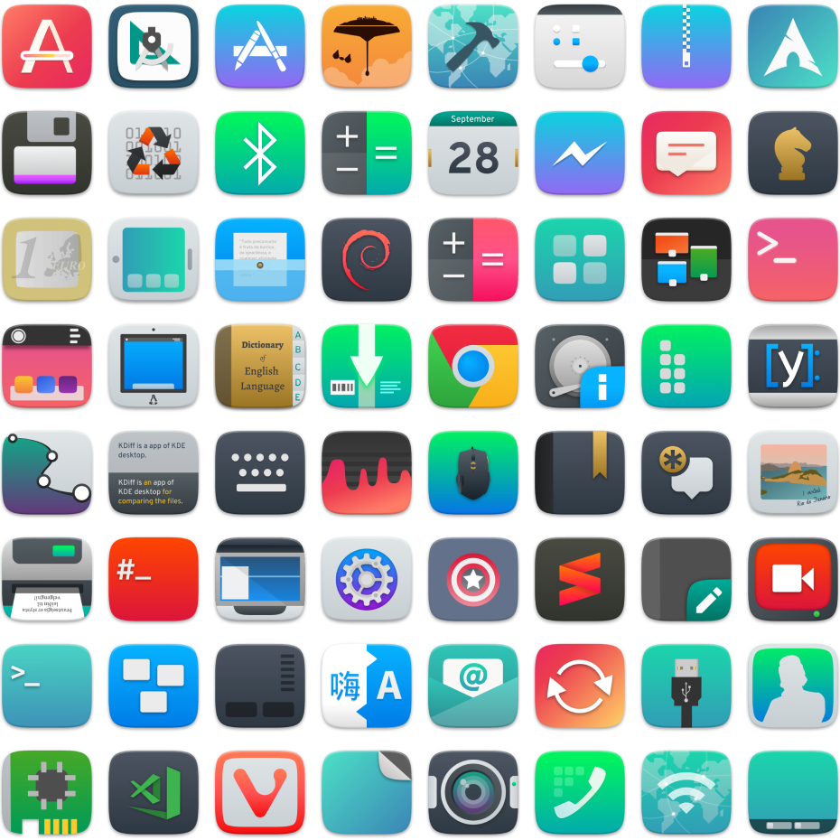

# Features

## Redesign

Following Sam Hewitt’s rules of grids, and making less conservative and traditional <a href="https://github.com/Bonandry">@Bonandry</a>’s <a href="https://github.com/Bonandry/suru-plus-ubuntu">Suru++ Ubuntu</a>, more than 15k icons have been redesigned, papirusified and improved with new cyberpunk colours and made been compatible with KDE, XFCE and other many environments! Check the new icons:

