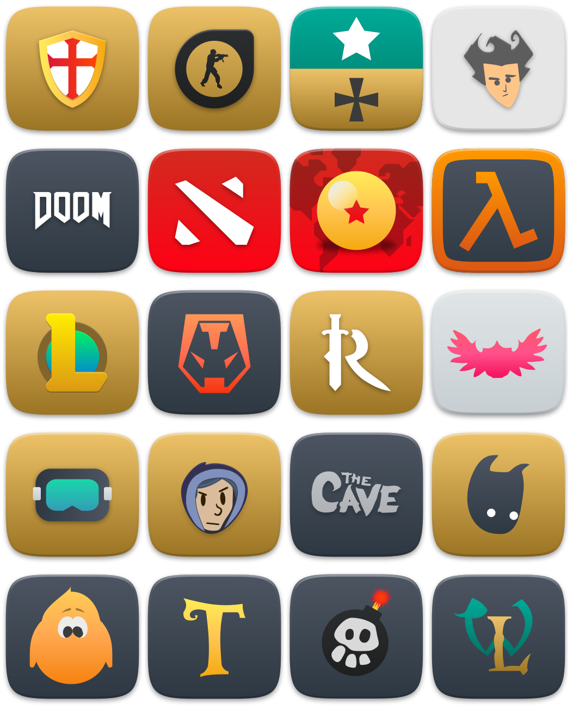
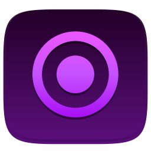
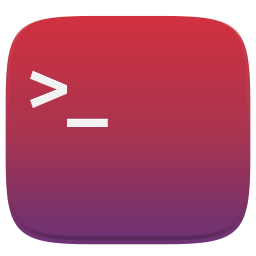
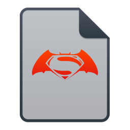
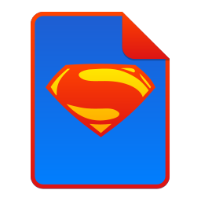
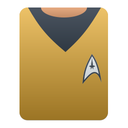
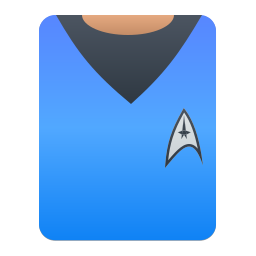
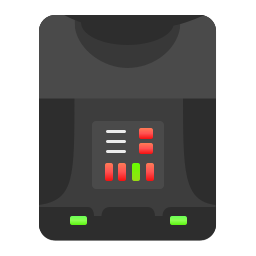
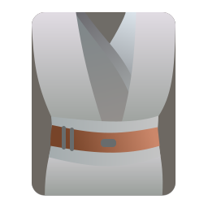

- [Funções](#funções)
  - [Redesenho de ícones de aplicativos](#redesenho-de-ícones-de-aplicativos)
  - [Redesenho de ícones de tipos de arquivo de mídia](#redesenho-de-ícones-de-tipos-de-arquivo-de-mídia)
  - [Redesenho de pastas com novas cores](#redesenho-de-pastas-com-novas-cores)
  - [Distinção dos gerenciados de arquivos](#distinção-dos-gerenciados-de-arquivos)
  - [Pastas exclusivas e especiais](#pastas-exclusivas-e-especiais)
  - [Jogos do Steam](#jogos-do-steam)
  - [Cores sólidas e dos gradientes dos ícones de 16px](#cores-sólidas-e-dos-gradientes-dos-ícones-de-16px)
  - [Ícones alternativos](#Ícones-alternativos)
    - [Aplicativos](#aplicativos)
    - [Tipos de arquivo de mídia](#tipos-de-arquivo-de-mídia)

# Funções

Abandone o conservadorismo e o tradicionalismo dos ícones do Suru originais, desenhados por Andrea Bonanni e Sam Hewitt, dirija uma Millennium Falcon, USS Discovery/Enterprise ou The Milano, viaja para o século 30, ou anos 3000 ou 3-4º milênio e cumprimente o cyberpunkismo, futurismo e modernismo!

## Redesenho de ícones de aplicativos

Seguindo as regras das grades de Sam Hewitt, e tornando os ícones do <a href="https://github.com/Bonandry/suru-plus-ubuntu">Suru++ Ubuntu</a> do <a href="https://github.com/Bonandry">@Bonandry</a> menos conservadores e tradicionais, mais de 15 mil ícones foram redesenhados, com o estilo do Papirus e melhorados com novas cores *cyberpunk* e se tornaram compatíveis com o KDE, XFCE e outros ambientes gráficos! Cheque os novos ícones:

  

## Redesenho de ícones de tipos de arquivo de mídia

Baseado nos ícones do tipo de arquivo de mídia dos temas Numix e Papirus. Como eu prometi a vocês que eu ia redesenhar os ícones do tipo de arquivo de mídia durante as versões 20 e 25. Finalmente, na versão mais recente, ou seja, 30, eu redesenhei os ícones do tipo de arquivo de mídia! Com ícones coloridos, é fácil reconhecer o arquivo, documento e imagem por meio da extensão!

  

## Redesenho de pastas com novas cores

As novas versões ganharam novas cores de pastas, baseadas no Papirus do Alexey Varfolomeev. Na versão 25.0, ganhou novas pastas com cor do Linux Mint. Na versão 25.2.0, mais três cores de pastas — índigo, rosa e cor de Manjaro. Finalmente, na versão 30, ele suporta oficialmente gradientes e ganhou mais novas cores — Verão 90s, Aurora e FitDance. Baseado no Suru++ Ubuntu, mais novas cores: cor de vinho de Bordéus e de vermelhão, e cores de Canonical, Disco Dingo e Ubuntu. Com a compatibilidade total com o tema [Cyberpunk Neon](https://github.com/Roboron3042/Cyberpunk-Neon) do [@Roboron3042](https://github.com/Roboron3042), ganhou novas pastas com cores do Cyberpunk Neon!

Como o Suru++ é oficialmente compatível com o [Oomox](https://github.com/themix-project/oomox) do [@actionless](https://github.com/actionless), você pode alterar qualquer cor de todas as pastas de uma vez por todas!

  

## Distinção dos gerenciados de arquivos

Os gerenciadores de arquivos não são mais mesmos, agora você pode distinguir facilmente os gerenciadores de arquivos, com cores diferentes, modernas e novas!

  

## Pastas exclusivas e especiais

Não apenas cyberpunkismo e futurismo, você também é fã de séries e filmes de ficção científica, de astronomia e engenharia aeroespacial, e de Tesla? Na versão 30, abril é o mês de dias internacionais de astronautas, astronomia, engenharia aeroespacial, cosmologia, primeira imagem de buraco negro e de homenagem ao filme Avengers: Ultimato! Aqui está:

  

## Jogos do Steam

Centenas de ícones de jogos do Steam são suportados oficialmente:

    

## Cores sólidas e dos gradientes dos ícones de 16px

Como o Suru++ é oficialmente compatível com o [Oomox](https://github.com/themix-project/oomox) do [@actionless](https://github.com/actionless) e o meu *plugin* [Suru++ Colourise](https://github.com/gusbemacbe/suru-plus-colourise) com a ajuda e a contribuição do [@actionless](https://github.com/actionless) e do [@SmartFinn](https://github.com/SmartFinn), você pode escolher uma das 9 cores do gradiente *cyberpunk* ou alterar qualquer cor de todos os ícones de 16px ou ativar o gradiente de ícones de 16px de uma vez por todas!

Na versão 30, como Suru++ é compatível com o tema [Cyberpunk Neon](https://github.com/Roboron3042/Cyberpunk-Neon) do [@Roboron3042](https://github.com/Roboron3042), o tema ganhou o novo gradiente com cores do Cyberpunk Neon!

    

## Ícones alternativos

A maioria dos ícones de sessão e usuário foram redesenhados por [@darcn181](https://github.com/darcn181). Nas versões 25 e 30, mais e mais novos ícones alternativos! Você pode escolher um dos alternativos:

### Aplicativos 

<table style="undefined; table-layout: fixed; width: 600px">
  <colgroup>
    <col style="width: 200px">
    <col style="width: 360px">
  </colgroup>
  <tr>
    <th>ícone oficial </th>
    <th>ícones alternativos</th>
  </tr>

  <tr><td rowspan="2">cs-overview.svg</td>
    <td> cs-overview-alt1.svg</td>
  </tr>
  <tr><td> cs-overview-alt2.svg</td></tr>

  <tr><td rowspan="2">dde-file-manager.svg</td>
    <td> dde-file-manager-alt1.svg</td>
  </tr>
  <tr><td> dde-file-manager-alt2.svg</td></tr>

  <tr><td rowspan="4">drgeo.svg</td>
    <td> drgeo-alt1.svg</td>
  </tr>
  <tr><td> drgeo-alt2.svg</td></tr>
  <tr><td> drgeo-alt3.svg</td></tr>
  <tr><td> drgeo-alt4.svg</td></tr>

  <tr><td rowspan="3">firefox.svg</td>
    <td> firefox-mozilla.svg</td>
  </tr>
  <tr><td> firefox-traditional.svg</td></tr>
  <tr><td> firefox.svg</td></tr>

  <tr><td rowspan="2">gnome-lockscreen.svg</td>
    <td> gnome-lockscreen-alt1.svg</td>
  </tr>
  <tr><td> gnome-lockscreen-alt2.svg</td></tr>

  <tr><td rowspan="2">keyboard.svg</td>
    <td> keyboard-alt1.svg</td>
  </tr>
  <tr><td> keyboard-alt2.svg</td></tr>

  <tr><td rowspan="3">settings.svg</td>
    <td> settings-alt1.svg</td>
  </tr>
  <tr><td> settings-alt2.svg</td></tr>
  <tr><td> settings-alt3.svg</td></tr>

  <tr><td rowspan="6">sublime-text.svg</td>
    <td> sublime-text-alt1.svg</td>
  </tr>
  <tr><td> sublime-text-alt2.svg</td></tr>
  <tr><td> sublime-text-alt3.svg</td></tr>
  <tr><td> sublime-text-alt4.svg</td></tr>
  <tr><td> sublime-text-alt5.svg</td></tr>
  <tr><td> sublime-text-alt6.svg</td></tr>

  <tr><td rowspan="2">superproductivity.svg</td>
    <td> superproductivity-alt1.svg</td>
  </tr>
  <tr><td> superproductivity-alt2.svg</td></tr>

  <tr><td rowspan="3">system-suspend-hibernate.svg</td>
    <td> system-suspend-hibernate-alt1.svg</td>
  </tr>
  <tr><td> system-suspend-hibernate-alt2.svg</td></tr>
  <tr><td> system-suspend-hibernate-alt3.svg</td></tr>

  <tr><td rowspan="3">system-lock-screen.svg</td>
    <td> system-lock-screen-alt1.svg</td>
  </tr>
  <tr><td> system-lock-screen-alt2.svg</td></tr>
  <tr><td> system-lock-screen-alt3.svg</td></tr>

  <tr><td rowspan="3">system-log-out.svg</td>
    <td> system-log-out-alt1.svg</td>
  </tr>
  <tr><td> system-log-out-alt2.svg</td></tr>
  <tr><td> system-log-out-alt3.svg</td></tr>

  <tr><td rowspan="3">system-reboot.svg</td>
    <td> system-reboot-alt1.svg</td>
  </tr>
  <tr><td> system-reboot-alt2.svg</td></tr>
  <tr><td> system-reboot-alt3.svg</td></tr>

  <tr><td rowspan="3">system-shutdown.svg</td>
    <td> system-shutdown-alt1.svg</td>
  </tr>
  <tr><td> system-shutdown-alt2.svg</td></tr>
  <tr><td> system-shutdown-alt3.svg</td></tr>

  <tr><td rowspan="3">system-suspend.svg</td>
    <td> system-suspend-alt1.svg</td>
  </tr>
  <tr><td> system-suspend-alt2.svg</td></tr>
  <tr><td> system-suspend-alt3.svg</td></tr>

  <tr><td rowspan="4">terminal.svg</td>
    <td> terminal-alt1.svg</td>
  </tr>
  <tr><td> terminal-alt2.svg</td></tr>
  <tr><td> terminal-alt3.svg</td></tr>
  <tr><td> terminal-alt4.svg</td></tr>

  <tr><td rowspan="2">tiling.svg</td>
    <td> tiling-alt1.svg</td>
  </tr>
  <tr><td> tiling-alt2.svg</td></tr>

  <tr><td rowspan="5">user.svg</td>
    <td> user-alt1.svg</td>
  </tr>
  <tr><td> user-alt2.svg</td></tr>
  <tr><td> user-alt3.svg</td></tr>
  <tr><td> user-alt4.svg</td></tr>
  <tr><td> user-alt5.svg</td></tr>
</table>

### Tipos de arquivo de mídia

<table style="undefined; table-layout: fixed; width: 600px">
  <colgroup>
    <col style="width: 200px">
    <col style="width: 360px">
  </colgroup>
  <tr>
    <th>ícone oficial </th>
    <th>ícones alternativos</th>
  </tr>

  <tr><td rowspan="4">comics-book.svg</td>
    <td> comics-book-alt1.svg</td>
  </tr>
  <tr><td> comics-book-alt2.svg</td></tr>
  <tr><td> comics-book-alt3.svg</td></tr>
  <tr><td> comics-book-alt4.svg</td></tr>

  <tr><td rowspan="5">mimetype-theme.svg</td>
    <td> mimetype-theme-alt1.svg</td>
  </tr>
  <tr><td> mimetype-theme-alt2.svg</td></tr>
  <tr><td> mimetype-theme-alt3.svg</td></tr>
  <tr><td> mimetype-theme-alt4.svg</td></tr>
  <tr><td> mimetype-theme-alt5.svg</td></tr>
</table>