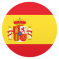

    

<h4 align="center">A third-party Suru icons for more than 20 distributions </h4>
<h4 align="center">Successor of <a href="https://github.com/Bonandry">@Bonandry</a>’s <a href="https://github.com/Bonandry/suru-plus-ubuntu">Suru++ Ubuntu</a></h4>
<h4 align="center">A cyberpunkish, elegant, futuristic, macOS-like, Papirus-like and modern Suru icons based on <a href="https://snwh.org/suru">Suru Icons</a> by Sam Hewitt</h4>

  
  
  
  
  
  

#### Eigenschaften – Features – Funciones – Fonctionnalités – Aspetti – Eigenschappen – Funções
 <a href="features-de.md"> – Weiß die neuen Eigenschaften! 
 <a href="features-en.md"> – Come to know new features! 
 <a href="features-es.md"> – ¡Conozca las nuevas funciones! 
 <a href="features-fr.md"> – Connaissez les nouvelle fonctionnalités ! 
 <a href="features-it.md"> – Conosci i nuovi aspetti! 
 <a href="features-nl.md"> – Weet de nieuwe eigenschappen! 
 <a href="features-pt-br.md"> – Venha conhecer novas funções! 
 <a href="features-pt-br.md"> – Conhece novas funções! 

#### <a href="https://github.com/gusbemacbe/suru-plus/wiki">Wiki</a>

 Zum wie installieren, deinstallieren, Bugs überprüfen und das Ikon ânderen zu wissen, besuche die „<a href="https://github.com/gusbemacbe/suru-plus/wiki">wiki</a>“. 
 To know how to install, unistall, check the bugs and change the icon, visit ‘<a href="https://github.com/gusbemacbe/suru-plus/wiki">wiki</a>’. 
 Para sber como instalar, desinstalar, verificar los *bugs* y modificar el icono, visite la «<a href="https://github.com/gusbemacbe/suru-plus/wiki">wiki</a>». 
 Pour savoir comme installer, désintaller, voir les bouges et changer l'icônes, visitez la « <a href="https://github.com/gusbemacbe/suru-plus/wiki">wiki</a> ». 
 Per sapere come installare, desintallare, controllare i *bug* e modificare l'icona, visita la «<a href="https://github.com/gusbemacbe/suru-plus/wiki">wiki</a>». 
 Om hoe installeren, deïnstalleren, de *bugs* controlleren en het pictogram veranderen, bezoek de „<a href="https://github.com/gusbemacbe/suru-plus/wiki">wiki</a>”. 
 Para saber como instalar, desintalar, verificar os *bugs* e mudar o ícone, visite a “<a href="https://github.com/gusbemacbe/suru-plus/wiki">wiki</a>”. 
 Para sber como instalar, desinstalar, checar os *bugs* e modificar o ícone, visita a «<a href="https://github.com/gusbemacbe/suru-plus/wiki">wiki</a>».  

* CC BY-SA/GPL3 © 2018-2019 [Suru Icons](https://github.com/snwh/suru-icon-theme) by [Sam Hewitt](https://github.com/snwh).
* GPL3 © 2018-2019 [Suru++ Ubuntu](https://github.com/Bonandry/suru-plus) by [Andrea Bonanni](https://github.com/Bonandry) and Gustavo Costa.
* GPL3 © 2018-2019 Suru++ 25 by Gustavo Costa.
* GPL3 © [Papirus](https://github.com/PapirusDevelopmentTeam/) by [Alexey Varfolomeev](https://github.com/varlesh).
* GPL3 © [Numix](https://github.com/numixproject/numix-icon-theme) by Numix Team.
* GPL3/MIT © 2015-2019 [La Capitaine](https://github.com/keeferrourke/la-capitaine-icon-theme) by [Keefer Rourke](https://github.com/keeferrourke).
* MIT © Icons 8 by Gravit Designer1
* MIT © Twemoji by Twitter Team.

1 Gravit Designer has a special agreement with Icons 8 and allows the Pro user of Gravit Designer to use any icon without attribution and to sub-licence under an open source licence. See the <a href="https://discuss.gravit.io/t/licence-of-icons/2767">topic here</a>.
